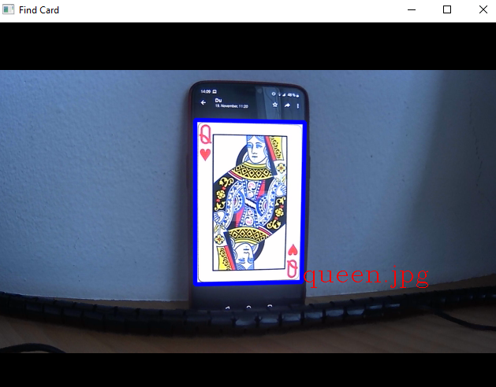

# Card-Detector
A little python OpenCV project.  
It detects all images (cards), from the folder ``img``, and draws a rectangle 
and the name of the image over the stream-input. 

## What it does
- Selects your webcam and uses as input-stream
- Creates an ``SIFT`` object from ``OpenCV`` to detect the images
- Gathering all images from the folder ``img`` and makes for each img an model: 
``model[keypoints, descriptor, name, image]`` 
- for each frame it will compare the models on ``k-Nearest-Neighbor``
- if the result is under an certain threshold, draw rectangle and name around the right position.

## Results

